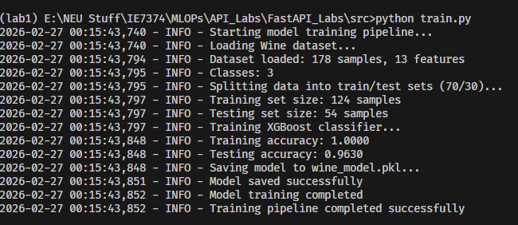
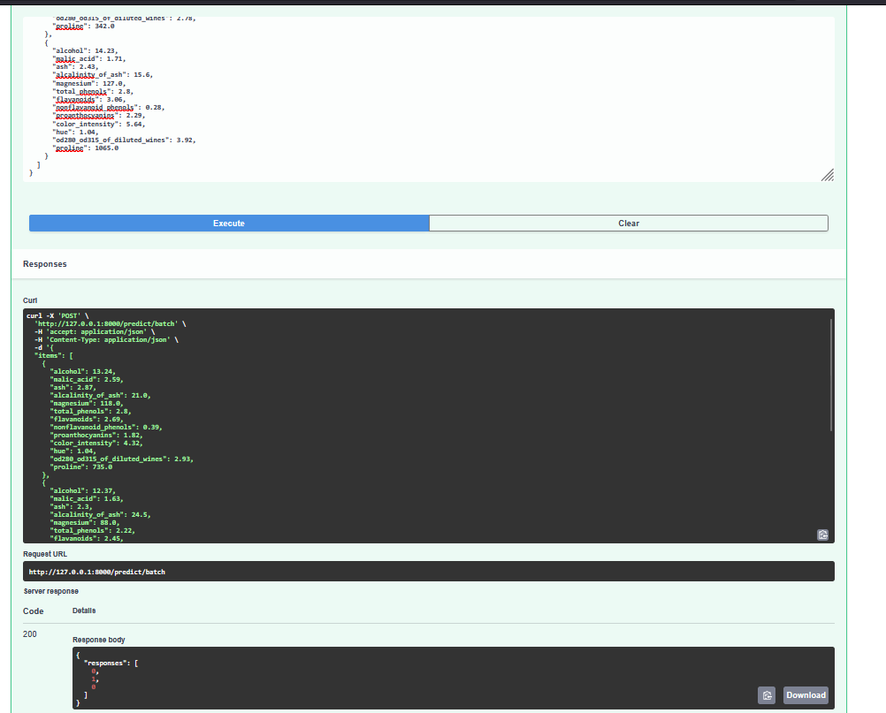

# FastAPI Labs - MLOps

Expose a trained machine learning model as an API using FastAPI and uvicorn.

## Changes Made for FastAPI Lab

- Switched dataset to Wine
- Replaced Decision Tree with XGBoost
- Added logging across training and API
- Added `/features`, `/model-info`, `/classes`, `/version`, and batch prediction endpoints
- Updated requirements and docs

## Project Overview

This lab trains an XGBoost classifier on the Wine dataset and serves predictions through a FastAPI application.

### Lab: Wine Classification API with XGBoost

A lightweight API project that trains and serves a multiclass XGBoost model.

**Key Features:**
- XGBoost classifier for multiclass classification
- Wine dataset
- FastAPI + uvicorn API service
- Batch prediction endpoint
- Built-in logging

## Prerequisites

### For Local Development
- Python 3.12 or higher
- pip (or uv if you prefer)
- Git

## Getting Started

### Local Setup

1. **Navigate to the lab**
   ```bash
   cd API_Labs/FastAPI_Labs
   ```

2. **Install dependencies**
   ```bash
   pip install -r requirements.txt
   ```

3. **Verify installation**
   ```bash
   python -c "import xgboost; import sklearn; import fastapi"
   ```

### Running Locally

1. **Train the model**
   ```bash
   cd src
   python train.py
   ```
   
   

2. **Run the API**
   ```bash
   uvicorn main:app --reload
   ```

3. **Open the docs**
   - http://127.0.0.1:8000/docs

## API Endpoints

- `GET /` Health check
- `GET /features` Ordered model features
- `GET /model-info` Dataset class names + feature count
- `GET /classes` Class names only
- `GET /version` API version
- `POST /predict` Single prediction
- `POST /predict/batch` Batch predictions

## Example Requests

Single prediction:
```bash
curl -X POST "http://127.0.0.1:8000/predict" \
  -H "Content-Type: application/json" \
  -d '{"alcohol":13.2,"malic_acid":1.8,"ash":2.3,"alcalinity_of_ash":15.5,"magnesium":100.0,"total_phenols":2.3,"flavanoids":2.0,"nonflavanoid_phenols":0.3,"proanthocyanins":1.9,"color_intensity":5.6,"hue":1.0,"od280_od315_of_diluted_wines":3.1,"proline":750.0}'
```

Batch prediction:
```bash
curl -X POST "http://127.0.0.1:8000/predict/batch" \
  -H "Content-Type: application/json" \
  -d '{"items":[{"alcohol":13.2,"malic_acid":1.8,"ash":2.3,"alcalinity_of_ash":15.5,"magnesium":100.0,"total_phenols":2.3,"flavanoids":2.0,"nonflavanoid_phenols":0.3,"proanthocyanins":1.9,"color_intensity":5.6,"hue":1.0,"od280_od315_of_diluted_wines":3.1,"proline":750.0}]}'
```



## Dependencies

- **fastapi[all]** - API framework + uvicorn
- **scikit-learn** - Dataset utilities
- **xgboost** - Gradient boosting classifier
- **joblib** - Model serialization

## Troubleshooting

**Model file not found:**
- Ensure you ran `python train.py` from the src directory.

**API import errors:**
- Reinstall dependencies: `pip install -r requirements.txt`

**Uvicorn fails to start:**
- Confirm you are in the src directory and run `uvicorn main:app --reload` or `uv run uvicorn main:app` if using uv
