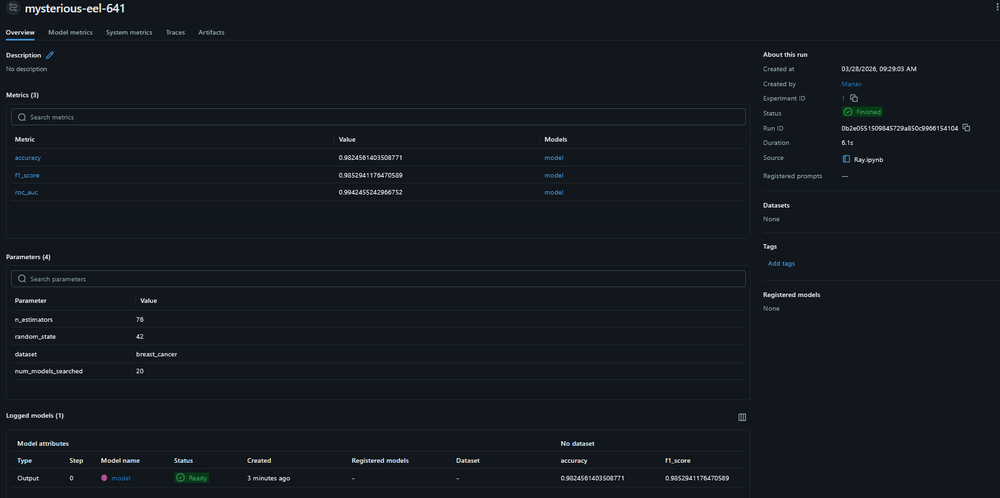

# Model Development - Ray Distributed Training

Distributed hyperparameter search using Ray with XGBoost on the Breast Cancer dataset.

## Changes Made

- Changed dataset to Breast Cancer (`sklearn.datasets`)
- Replaced Random Forest with XGBoost (`XGBClassifier`)
- Added sequential vs parallel performance comparison plot
- Added detailed best model evaluation: classification report, confusion matrix, ROC curve, feature importance
- Added MLflow tracking for params, metrics, model, and plot artifacts
- Updated requirements and docs

## Project Overview

This lab demonstrates how Ray can accelerate hyperparameter search by distributing model training across all available CPU cores. 20 XGBoost models are trained with increasing `n_estimators` both sequentially and in parallel, showcasing Ray's performance gains.

**Key Features:**
- Ray distributed task execution (`@ray.remote`, `ray.put`, `ray.get`)
- XGBoost binary classifier on Breast Cancer dataset
- Sequential vs parallel wall-time comparison
- Accuracy vs n_estimators visualization
- Confusion matrix, ROC curve, and feature importance plots
- MLflow experiment tracking


## Current Structure

```text
Model_Development/
  README.md
  Ray.ipynb
  mlflow.png                   
  accuracy_vs_estimators.png   
  confusion_matrix.png         
  roc_curve.png               
  feature_importance.png       
```

## Workflow: Notebook (`Ray.ipynb`)

`Ray.ipynb` runs end-to-end and includes:

1. **Data** — load Breast Cancer dataset, 80/20 train/test split
2. **Sequential** — train 20 `XGBClassifier` models (n_estimators 8→84, step 4), results in `seq_scores`
3. **Ray setup** — `ray.init()`, place data in object store with `ray.put()`
4. **Parallel** — same 20 models via `@ray.remote` + `ray.get()`, results in `par_scores`
5. **Comparison plot** — accuracy vs n_estimators for both runs overlaid
6. **Best model evaluation** — retrain best, output:
   - Classification report (precision, recall, F1)
   - Confusion matrix
   - ROC curve with AUC
   - Top 15 feature importances
7. **MLflow** — log params, metrics, model, and all plot artifacts

## MLflow UI

Start the tracking UI from `Model_Development/`:

```bash
mlflow ui
```

Open `http://127.0.0.1:5000` in your browser. The `ray-breast-cancer-xgboost` experiment will show all logged runs with:

- **Params** — `n_estimators`, `random_state`, `dataset`, `num_models_searched`
- **Metrics** — `accuracy`, `f1_score`, `roc_auc`
- **Artifacts** — trained XGBoost model, confusion matrix, ROC curve, feature importance, accuracy vs n_estimators plot



## Dependencies

- **ray** - Distributed task execution
- **xgboost** - Gradient boosting classifier
- **mlflow** - Experiment tracking
- **scikit-learn** - Dataset, metrics, model selection
- **pandas** - Data handling
- **matplotlib** - Plotting
- **seaborn** - Visualization